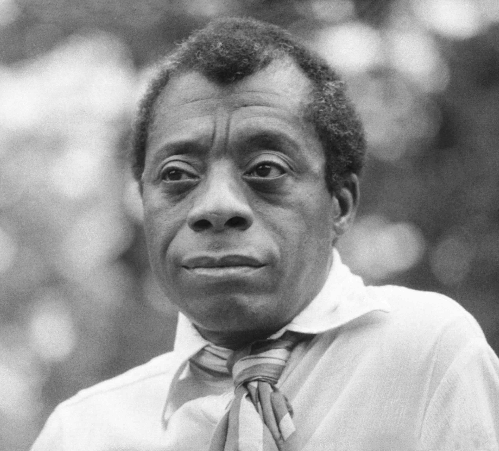

# Teaching Civil Rights Through James Baldwin

Helping Students Connect with History

---

## The Big Idea

**Connection > Coverage**

When students see themselves in history, everything clicks.

Speaker notes: This is the core insight. Teaching civil rights isn't about facts and dates—it's about helping students feel part of an ongoing story. Baldwin showed us how: personal stories + present relevance.

---

## James Baldwin (1924-1987)

Writer. Essayist. Teacher (in his own way).

Made big ideas feel personal.

Speaker notes: Born in Harlem. His approach—connecting abstract history to real human experience—is exactly what good teaching looks like. He's a model for HOW to teach, not just WHAT to teach.

---

## His Key Insight

> "History is not the past. It is the present."

Speaker notes: This changes everything. Civil rights isn't a chapter to get through—it's happening now. Your students live in a world shaped by this history. When we teach civil rights, we help them understand their world.

---

## Start Where They Are

| Age | They Already Get | Build From There |
|-----|------------------|------------------|
| Pre-K to 2nd | Fairness, "that's not fair!" | "What makes something fair for everyone?" |
| 3rd to 5th | Rules exist, rules can change | "Who decides rules? Can rules be wrong?" |
| 6th to 8th | Injustice exists, people fight back | "What gives movements power?" |
| 9th to 12th | Systems, power, complexity | "How do Baldwin's words apply today?" |

Speaker notes: Same topic, different entry points. This is differentiation in action. You adjust complexity, never importance.

---

## Questions > Answers

❌ "The Civil Rights Movement was a period from 1954-1968..."

✅ "Think about a time something felt unfair. What did you want to happen?"

Speaker notes: Questions open minds; lectures close them. Questions work at EVERY grade level. They honor what students already know and create genuine curiosity.

---

## Stories > Abstractions

| Don't Say | Say Instead |
|-----------|-------------|
| "Schools were segregated" | "Ruby Bridges, age 6, walked past angry crowds" |
| "People protested" | "John Lewis, age 23, was beaten on a bridge" |
| "Laws changed" | "Claudette Colvin, age 15, refused her seat" |

**They think: "That could be me."**

Speaker notes: This was Baldwin's secret—individual stories make abstract history concrete. Stories create empathy. Empathy creates understanding. That's when light bulbs turn on.

---

## What It IS vs. IS NOT

| IS | IS NOT |
|----|--------|
| Understanding shared history | Making anyone feel guilty |
| Connecting past to present | Staying stuck in the past |
| Age-appropriate honesty | Traumatizing with graphic details |
| Building empathy | Telling students what to think |
| Ongoing conversation | One-and-done checkbox |

Speaker notes: The IS NOT column addresses common fears teachers have. Worth posting in a classroom.

---

## Adapting for Learners

**Need more support:**
- More visuals, fewer words
- Pre-teach vocabulary
- Sentence starters

**Ready for more:**
- Original Baldwin texts
- Cross-curricular connections
- Leadership roles

Speaker notes: Everyone can engage with civil rights. You adjust complexity, never importance. "Primary sources" means original documents from the time period.

---

## Building Your Intuition

Over time, you'll sense:

- When to push deeper vs. pause
- Which stories resonate
- How much context different ages need

**What kind of civil rights teacher do YOU want to be?**

Speaker notes: Rules help you start. Intuition helps you grow. This is about developing your professional identity—heavy on stories or analysis? Discussion-based or project-based? There's no single right answer.

---

## Common Pitfalls

- **Oversimplifying:** "Good guys won, bad guys lost"
- **Avoiding discomfort:** Students sense it
- **Assuming sameness:** Disrespects their experiences
- **Overcorrecting:** So heavy students shut down

Speaker notes: Every teacher makes some of these. Awareness helps you catch and correct. The balanced approach: honest about difficulty, clear about progress, open to student responses.

---

## Key Takeaways

1. Connection, not coverage
2. Personal stories + present relevance
3. Adjust for age, never skip the topic
4. Your style emerges through practice

Speaker notes: Summarize before group work. This frames what they should discuss in their groups.

---

## Group Discussion

**Instructions:**
- Read prompts on your device
- Discuss verbally with your group
- Summarize key points on paper

I'll visit each group to hear your thinking.

Speaker notes: Circulate actively. Ask "Why?" and "What if?" to push thinking. Look for connections between today's ideas and their future teaching.

---

## Wrap-Up

> "The purpose of education... is to create in a person the ability to look at the world for himself." — James Baldwin

**Next:** Complete the quiz on Google Classroom.

Speaker notes: Quick summary, then transition to individual assessment.
